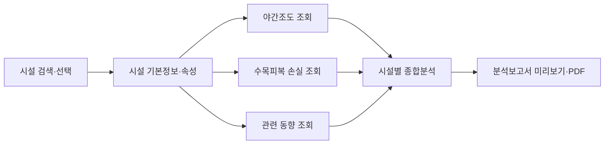

# 북한 시설·위성정보 변화 분석 PoC

북한 시설물 정보를 중심으로 야간조도, 수목피복 손실, 관련 동향을 한 화면에서 조회하고 비교하는 공개자료 기반 분석 PoC입니다. 현재는 평양권 시설을 중심으로 구현되어 있으며, 시설물 단위의 변화 탐색과 근거 기반 보고서 생성을 검증하는 데 목적이 있습니다.

이 프로젝트는 위성 관측값이나 관련 동향만으로 시설 운영 상태·정책 변화·변화 원인을 확정하지 않습니다. 관측 결과와 해석을 분리하고, 추가 확인이 필요한 참고자료로 제공합니다.

## 주요 기능

- 시설물 검색·선택 및 지도상의 위치 표시
- 시설물 기본정보, 분류, 주소, 속성, 관련 동향 조회
- NOAA VIIRS DNB 기반 야간조도 연도별 조회
- 기준연도와 비교연도의 야간조도 Difference 비교
- 두 연도의 야간조도를 직접 비교하는 Swipe 보기
- 연도별 야간조도 변화를 확인하는 Timeline
- Hansen Global Forest Change 기반 수목피복 손실 조회
- 야간조도·산림변화·관련 동향을 결합한 시설별 종합분석
- 분석 결과 미리보기 및 PDF 보고서 다운로드

## 분석 흐름



## 시스템 구성

```text
React + TypeScript + Vite + MapLibre
                    │
                    ▼
              FastAPI API
                    │
          ┌─────────┴─────────┐
          ▼                   ▼
   Supabase/PostGIS       Google Earth Engine
  시설·동향·통계 데이터       VIIRS·Hansen 처리
```

| 영역 | 구성 |
|---|---|
| 웹 | React 19, TypeScript, Vite, MapLibre GL, Zustand, ECharts |
| API | FastAPI, Python 3.12+, Supabase Python SDK |
| 데이터 처리 | Google Earth Engine, GeoPandas, Pandas, OpenPyXL |
| 저장소 | Supabase PostgreSQL/PostGIS |
| 배포 | Vercel(웹), Render(API) |

## 저장소 구조

```text
apps/web       React 웹 UI
apps/api       FastAPI API와 분석·보고서 엔진
pipelines/etl  GeoJSON·Excel 정제 및 적재 준비
pipelines/gee  VIIRS·Hansen Earth Engine 처리 모듈
supabase       PostgreSQL/PostGIS 스키마와 마이그레이션
data/import    원본 데이터 입력 위치
docs           기획서·UI 명세·데이터 사전
tests          ETL 테스트
```

원본 파일은 용량·저작권·재배포 조건을 고려해 저장소에 포함하지 않습니다. 필요한 원자료를 `data/import/`에 배치한 뒤 ETL을 실행합니다.

## 데이터 구성

### 위성·공간 데이터

- VIIRS: `NOAA/VIIRS/DNB/MONTHLY_V1/VCMSLCFG`의 `avg_rad` 밴드
- Hansen Global Forest Change: 수목피복 손실 및 기간별 변화
- 북한 행정경계: GeoJSON 기반 행정구역 경계

VIIRS 값은 야간조도 변화의 관측 지표이며 시설 가동량의 직접 측정값이 아닙니다. Hansen 값은 산림파괴로 단정하지 않고 수목피복 손실로 표현합니다.

### Supabase 적재 현황

현재 연결된 데이터 스냅샷 기준입니다.

| 테이블 | 건수 |
|---|---:|
| `admin_boundaries` | 716 |
| `facilities` | 1,718 |
| `facility_attributes` | 5,585 |
| `trends` | 42,896 |
| `trend_facilities` | 17,525 |
| `nightlight_stats` | 24,052 |
| `forest_stats` | 24,052 |

위성 통계는 시설물 1,718건에 대해 2012~2025년 연도 단위로 적재되어 있습니다(`1,718 × 14 = 24,052`). 실제 제공 기간과 최신 공개 월은 데이터셋 버전에 따라 달라질 수 있습니다.

## 주요 API

### 상태·데이터

```text
GET  /health
GET  /health/db
GET  /api/v1/gee-status
GET  /api/v1/data-availability
GET  /api/v1/data-status
```

### 지도 레이어

```text
GET  /api/v1/map/tiles/nightlight/{year}
GET  /api/v1/map/tiles/nightlight/difference
GET  /api/v1/map/tiles/forest/{year}
GET  /api/v1/map/tiles/forest/period
GET  /api/v1/admin-boundaries
GET  /api/v1/admin-boundaries/{admin_code}
```

### 시설·분석·보고서

```text
GET  /api/v1/facilities
GET  /api/v1/facilities/{facility_id}
GET  /api/v1/facilities/{facility_id}/trends
GET  /api/v1/facilities/{facility_id}/timeseries
GET  /api/v1/facilities/{facility_id}/stats
GET  /api/v1/facilities/{facility_id}/analysis

POST /api/v1/reports
GET  /api/v1/reports/{report_id}
GET  /api/v1/reports/{report_id}/pdf
```

## 로컬 실행

### 준비물

- Git
- Node.js 22 LTS 및 npm
- Python 3.12 이상
- `uv`
- Supabase 프로젝트 또는 로컬 Supabase 환경
- GEE를 사용할 경우 Google Earth Engine 프로젝트 권한

### 환경 변수

루트 `.env` 또는 배포 환경에 다음 값을 설정합니다. 실제 키와 서비스 계정 정보는 README나 Git에 기록하지 않습니다.

```text
SUPABASE_URL
SUPABASE_ANON_KEY
SUPABASE_SERVICE_ROLE_KEY
GEE_PROJECT_ID
GEE_SERVICE_ACCOUNT
GOOGLE_APPLICATION_CREDENTIALS_JSON
WEB_BASE_URL
REPORT_LLM_PROVIDER
REPORT_LLM_MODEL
REPORT_LLM_API_KEY
```

### API 실행

```powershell
cd apps/api
uv sync
uv run uvicorn app.main:app --reload --port 8000
```

API 문서는 <http://localhost:8000/docs>에서 확인할 수 있습니다.

### 웹 실행

새 터미널에서 실행합니다.

```powershell
cd apps/web
npm install
npm run dev
```

웹 주소: <http://localhost:5173>

## 원자료 ETL

다음 파일을 `data/import/`에 배치합니다.

```text
NK_Admin_Boundary.geojson
북한지도 시설물 데이터.xlsx
북한지도 시설물 속성 데이터.xlsx
전체동향 데이터.xlsx
```

```powershell
uv run python -m pipelines.etl.inspect_inputs --input-dir data/import
uv run python -m pipelines.etl.admin --input data/import/NK_Admin_Boundary.geojson --output data/interim/admin_boundaries.geojson
uv run python -m pipelines.etl.facilities --input 'data/import/북한지도 시설물 데이터.xlsx' --output-dir data/interim
uv run python -m pipelines.etl.attributes --input 'data/import/북한지도 시설물 속성 데이터.xlsx' --output data/interim/facility_attributes.csv
uv run python -m pipelines.etl.trends --input 'data/import/전체동향 데이터.xlsx' --output data/interim/trends.csv
uv run python -m pipelines.etl.validate --input-dir data/interim
```

시설물 원본 좌표계가 확정되기 전까지 ETL은 원본 좌표를 보존하며 공간 변환을 보류합니다. 변환이 필요한 경우 `.env`의 `FACILITY_SOURCE_CRS`를 확인된 EPSG 코드로 설정합니다.

## 검증

```powershell
uv run pytest
cd apps/api
uv run pytest
cd ..\web
npm run build
npm run lint
```

## 분석 원칙과 현재 한계

1. 관측값과 해석을 분리합니다.
2. 단일 위성 지표로 시설의 운영 상태나 변화 원인을 확정하지 않습니다.
3. 야간조도 증가를 시설 가동 증가로 직접 해석하지 않습니다.
4. 위성 데이터와 관련 동향은 변화 탐색을 위한 근거자료로 함께 제시합니다.
5. 데이터가 없는 기간은 0으로 임의 대체하지 않습니다.
6. Render Free 환경에서는 콜드 스타트로 첫 응답이 늦어질 수 있습니다.
7. 보고서 PDF는 현재 텍스트 중심의 PoC 출력이며 지도 스냅샷·그래프 이미지는 포함하지 않습니다.
8. 화면과 분석 범위는 현재 평양권 시설 중심이며, 북한 전역 확장은 후속 과제입니다.

## 향후 확장

- 북한 전역 시설 검색과 행정구역 필터 강화
- 위성 데이터 자동 갱신 및 처리 버전 관리
- 보고서에 지도 스냅샷·차트 이미지 포함
- 추가 위성·공간 데이터셋 연계
- 시설·동향 연결 품질 개선
- 근거 패키지 기반 분석 보조 기능 고도화

## 배포

- Web: <https://pyongyang-satellite-poc.vercel.app>
- API: <https://pyongyang-satellite-poc.onrender.com>
- GitHub: <https://github.com/swainy195/pyongyang-satellite-poc>

배포 환경에서는 Supabase, GEE, 보고서 생성에 필요한 비밀값을 각 플랫폼의 환경 변수로 등록해야 합니다.

자세한 설계와 데이터 정의는 [`docs/MASTER_PLAN.md`](docs/MASTER_PLAN.md), [`docs/UI_SPEC.md`](docs/UI_SPEC.md), [`docs/DATA_DICTIONARY.md`](docs/DATA_DICTIONARY.md)를 참고하십시오.
